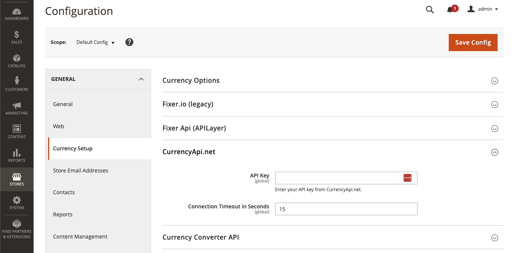
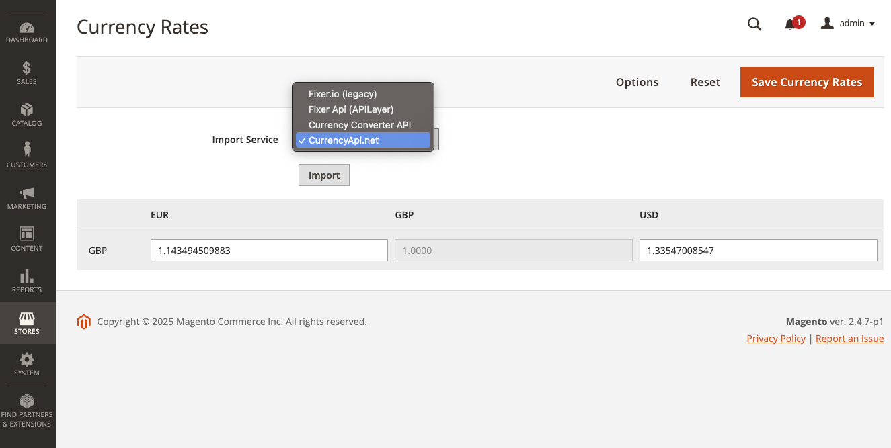
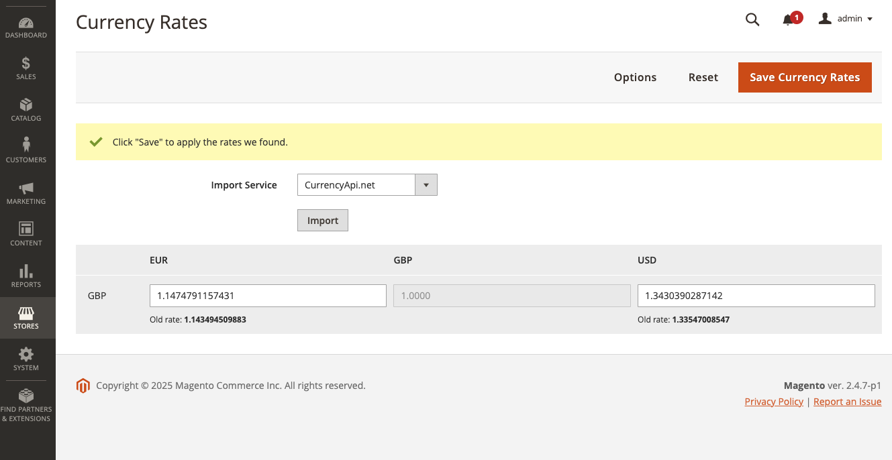

# Live Exchange Rates for Magento 2 using CurrencyApi.net

A Magento 2 extension that integrates with [CurrencyApi.net](https://currencyapi.net) to provide real-time currency exchange rates. A great alternative to Fixer.io.

## Features

- Real-time currency exchange rates from CurrencyApi.net
- Easy configuration through Magento admin
- Support for all major currencies
- Automatic rate updates via cron
- Secure API key storage
- Error handling and retry logic
- Comprehensive unit test coverage
- Docker-based development environment

## Installation

### Method 1: Composer from Packagist (Recommended)

```bash
composer require houseofapis/magento2-currencyapi-importer
```

### Method 2: Composer from Magento Marketplace

1. **Get your extension information**:
   - Log in to [Commerce Marketplace](https://marketplace.magento.com) with your account
   - Click **Your name** > **My Profile**
   - Click **My Purchases**
   - Find the extension and note the component name and version

2. **Ensure your `composer.json` includes the Magento repository**:
   ```json
   "repositories": [
       {
           "type": "composer",
           "url": "https://repo.magento.com/"
       }
   ]
   ```

3. **Install the extension with the specific version**:
   ```bash
   composer require houseofapis/magento2-currencyapi-importer:1.0.0
   ```

4. **Enter your authentication keys** when prompted (your public key is your username; your private key is your password)

### Method 3: Manual Installation

1. Download the extension files
2. Copy to `app/code/HouseOfApis/CurrencyApi/`

### Post-Installation Steps

After installing using any method above, run these commands:

```bash
# Enable the module
php bin/magento module:enable HouseOfApis_CurrencyApi

# Update the database schema
php bin/magento setup:upgrade

# Compile dependency injection
php bin/magento setup:di:compile

# Verify the module is enabled
php bin/magento module:status HouseOfApis_CurrencyApi

# Clean the cache
php bin/magento cache:clean
```

> **Note**: If you encounter any issues loading the storefront, run `php bin/magento cache:flush` to completely flush all caches.

## API Key

**You need an API key to use this extension.**

Get your API key by creating a free account at [CurrencyApi.net](https://currencyapi.net):
- Free plan: USD base currency only
- Paid plans: Required to change the base currency (for example to EUR, GBP, etc.)

## Configuration



1. Go to **Stores > Configuration > General > Currency Setup**
2. Select **CurrencyApi.net**
3. Enter your API key from [CurrencyApi.net](https://currencyapi.net)
4. Configure connection timeout if needed
5. Save configuration

## Importing Currency Rates



1. Go to **Stores > Currency Rates**
2. Click Import Service and select CurrencyApi.net
3. Click the Import button



1. The new rates will now be imported
2. Click Save Currency Rates to apply


## Requirements

- Magento 2.4.0 or higher
- PHP 8.1 or higher
- Valid CurrencyApi.net API key
- cURL extension enabled

## Magento Version Compatibility

| Magento Version | Extension Version | Status |
|----------------|-------------------|---------|
| 2.4.0 - 2.4.7  | 1.0.0            | ✅ Supported |
| 2.4.8+         | 1.0.0            | ✅ Supported |

## Currency List

We supply up to 152 fiat currencies, cryptos and precious metals.

By default, Magento does not support cryptos and precious metals and there maybe some old currencies that are available on Magento but not available from our API. 

For a full list of the currencies we supply, head over to [our currency list](https://currencyapi.net/currency-list/) page.

## Development

### Running Tests

This extension includes comprehensive unit tests. You can run them using Docker:

```bash
# Run all tests
make test

# Run tests with verbose output
make test-verbose

# Run tests with coverage report
make test-coverage

# Run specific test file
make test-specific

# Clean up Docker resources
make clean
```

### Test Structure

- `Test/Unit/` - Unit tests with mocked dependencies
- `Test/Fixtures/` - JSON fixtures for API responses
- `Test/Stubs/` - Magento interface stubs for testing
- Tests cover API integration, error handling, and configuration parsing

### Project Structure

```
├── Model/Currency/Import/
│   └── CurrencyApi.php          # Main import service
├── Test/
│   ├── Unit/                    # Unit tests
│   ├── Fixtures/                # Test data
│   └── Stubs/                   # Magento stubs
├── composer.json                # Package definition
├── registration.php             # Magento module registration
└── README.md                    # This file
```

## Troubleshooting

### Common Issues

**Currency rates not updating:**
- Verify your API key is correct
- Check if cron jobs are running
- Ensure your server can reach currencyapi.net

**"No API Key was specified" error:**
- Go to Stores > Configuration > Currency > Currency Rates
- Select "CurrencyApi.net" as import service
- Enter your API key and save

**Test failures:**
- Run `make test` to verify all tests pass
- Check Docker is running if using containerized tests

## Support

For support and questions, please contact:
- Email: support@currencyapi.net
- Website: [CurrencyApi.net](https://currencyapi.net)

## License

MIT License - see LICENSE file for details.
